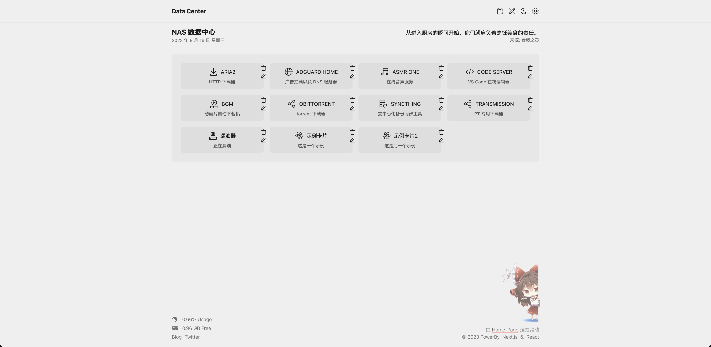

<h1 align="center">Home-Page</h1>




<p align="center">一个简洁的 NAS 主页 & 导航页</p>

## 使用方法

clone 本项目到你要部署的机器上

```bash
git clone https://github.com/kahosan/home-page.git ./home-page
```

然后进入项目文件夹并安装依赖

```bash
cd home-page && pnpm i # npm i
```

将 `.env.example` 改名为 .`env` 然后填写你所想更改的字段

修改根目录的 `services.json` 文件，按照如下格式。也可以部署后在网页端添加

```json5
[
  {
    "name": "名称",
    "description": "描述",
    "icon": "图标",
    "path": "地址" // 如 https://services.com/xxx，如果服务的域名和主页的域名相同，可以直接写 /xxx
  }
]
```

其中，`icon`，需要在 [这里](https://icones.js.org/collection/carbon) 找到你喜欢的图标，点击它会有一个类似 carbon:xxx 的字符串，右边有一个小小的复制按钮，点一下粘贴到 `icon` 字段即可。目前只支持 `carbon`

**footer 的 blog、twiiter 链接地址在 .env 文件中修改**

### build 项目并部署

在项目根目录下执行

```bash
pnpm run build # npm run build
```

然后运行

```bash
pnpm run start # -port 8765 可以这样选择端口
```

可以使用 nginx 代理，也可以直接输入部署服务器的 IP 和端口号直接访问

### 使用 Vercel

fork 本项目，然后导入到 vercel 中，环境变量需要根据 .env 文件中的需要，手动输入到 vercel 的项目设置里

### 修改自定义背景

把你想自定义的背景图放到 `public` 目录替换 `bg.png` 文件，然后修改 `src/index.css` 中最下面的 `.custom-bg` 的配置。需要会一点点的 css 知识

### 自定义 Title

修改 .env 文件中的 `HOME_HEADER_TITLE` 和 `HOME_TITLE` 两个字段

### 在线编辑应用列表

点击右上角的铅笔按钮。

如果部署在 vercel，存储的数据是在 `/tmp` 目录中，可能会丢失数据，本地部署则为修改 `services.json` 文件。

## 如果你想为本项目做贡献

欢迎 PR

## TODO

- [x] 在线编辑
- [ ] 导入导出功能
- [ ] 添加一些好玩的东西，暂时还没想法，如果有什么好的想法欢迎提 issue

## License

MIT
